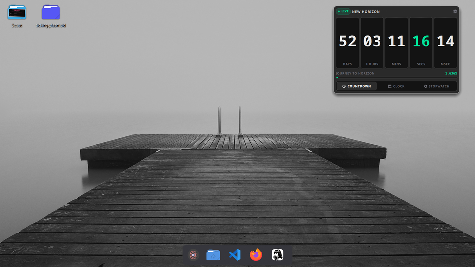
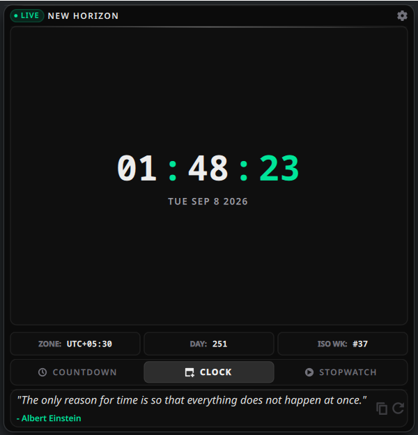
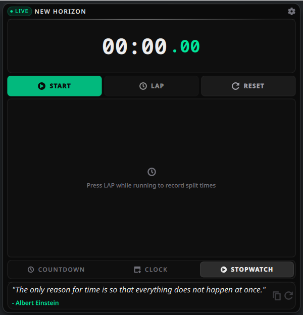
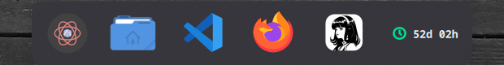

# Ticking - Horizon & Time HUD (KDE Plasma 6)

[](https://store.kde.org/p/2370240/)
[](https://github.com/adi-IL/ticking-plasmoid/releases/latest)
[](LICENSE)
[](https://kde.org/plasma-desktop/)

A high-aesthetic, Vercel-inspired desktop and panel widget for KDE Plasma 6. Designed for precision tracking toward custom event horizons, milestone deadlines, live digital world time, and high-precision stopwatch metrics.



---

## Visual Gallery

| Horizon Countdown | Live World Clock | Precision Stopwatch |
| :---: | :---: | :---: |
|  |  |  |
| Tabular cards, sub-second ticker, and journey progress | 12h/24h time, UTC offset, Day of Year, and Week # | Millisecond timer, hour support, and lap history |

### Minimal Panel Integration



Sleek minimal icon with remaining time badge that expands into the full HUD on click, with adaptive support for both horizontal docks and vertical panels.

---

## Key Features

- **Obsidian Glass & Plasma Adaptive Themes:**
  - **Vercel Obsidian Glass Mode:** Ultra-dark translucent surfaces, sub-pixel specular borders, and interactive cursor-tracking specular lighting.
  - **Plasma System Adaptive Mode:** Automatically harmonizes with your active KDE Plasma color scheme (Breeze, Breeze Dark, Catppuccin, Nord).
- **Dual Start & End Date Normalization:**
  - Graphical Month, Day, and Year selectors for both Start Date (00:00) and End Date (00:00).
  - Automatically assumes 00:00:00 midnight normalization without requiring manual time inputs.
  - Live journey span indicator calculating total elapsed days and percentage progress.
  - One-click presets: *New Year 2027*, *End of 2026*, *100-Day Goal*, and *October 25, 2026 Horizon*.
- **Universal Horizon Countdown:**
  - Modular tabular cards: Days, Hours, Minutes, Seconds, and live Sub-second Milliseconds.
  - Tabular monospace numerals to ensure jitter-free ticking.
  - Milestone celebration banner when the target horizon is reached.
- **Precision Live Clock:**
  - Full date string, 12h/24h time, UTC offset timezone indicator, day-of-year, and week-of-year counter.
- **Digital Stopwatch:**
  - Millisecond-accurate stopwatch with hour/minute/second support and Start / Pause / Lap / Reset controls.
  - Lap history table with split time calculations and balanced empty-state guidance.
- **Desktop & Panel Versatility:**
  - Desktop Mode: Floating HUD card with zero outer container border (`NoBackground` integration).
  - Panel Mode: Sleek minimal icon with remaining time badge that expands into the full HUD on click.
- **Adaptive Battery Throttling:**
  - Intelligent timer throttling (1000ms when idle or in panel, 40ms high-precision when actively viewed or tracking).
- **Internationalization (i18n):**
  - Full gettext localization support with PO template in `po/`.

---

## Requirements

- **KDE Plasma:** 6.0+ (Tested on Plasma 6.2+)
- **KDE Frameworks:** 6.0+ (Kirigami, KCMUtils, KPackage)
- **Qt:** 6.6+ (Qt Quick, Qt Quick Layouts, Qt Quick Controls)
- **Operating System:** Linux (Fedora KDE, Arch, openSUSE, Debian)

---

## Installation

### User Space Installation (Rootless)

```bash
# Clone repository
git clone https://github.com/adi-IL/ticking-plasmoid.git
cd ticking-plasmoid

# Package and install via kpackagetool6
kpackagetool6 -t Plasma/Applet --install .

# Or manual copy
mkdir -p ~/.local/share/plasma/plasmoids/org.adi_il.ticking
cp -r metadata.json contents ~/.local/share/plasma/plasmoids/org.adi_il.ticking/
```

### Upgrading Existing Installation

```bash
kpackagetool6 -t Plasma/Applet --upgrade .
```

---

## Development & Testing

### Run in Standalone Window

```bash
plasmawindowed org.adi_il.ticking
```

### Reload Plasma Shell

```bash
systemctl --user restart plasma-plasmashell.service
```

### Update Translation Template

```bash
python3 scripts/extract-messages.py
```

---

## License

GNU General Public License v3.0 or later ([GPL-3.0-or-later](LICENSE)).

---

Developed with ❤️ by **Aditya Gaurav** ([`adi-IL`](https://github.com/adi-IL))
