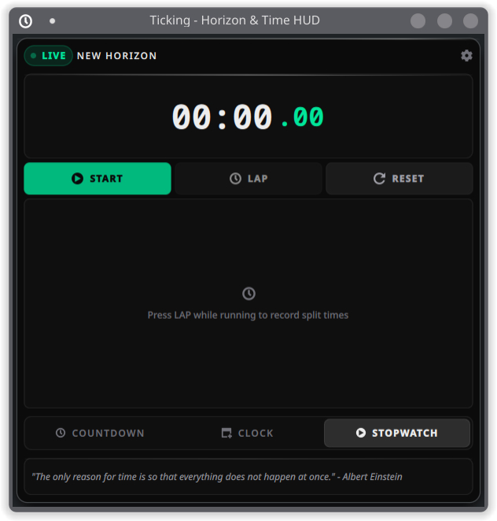

# Ticking - Horizon & Time HUD (KDE Plasma 6)

[](https://store.kde.org/p/2370240/)
[](https://github.com/adi-IL/ticking-plasmoid/releases/latest)
[](LICENSE)
[](https://kde.org/plasma-desktop/)

A desktop and panel HUD for KDE Plasma 6. Track your milestone countdown, read a clean world clock, run a split-lap stopwatch, and keep a quiet philosophy quote companion on your desktop.


---

## Visual Gallery

| Horizon Countdown | Live Clock | Precision Stopwatch |
| :---: | :---: | :---: |
|  |  |  |
| Tabular cards, live sub-second ticker, journey progress bar | 12h/24h formats, UTC offset, day of year, ISO week number | Split lap recording, hours support, 25 FPS live tick |

### Intellect Quote Companion



A quiet, rounded glass capsule at the bottom of the HUD. Rotates thought-provoking quotes on time, human craft, and discipline. The engine adapts to your milestone headline, journey progress, and time of day, running on a rhythm you choose (from 45 minutes to 6 hours).

Includes an offline library of 40+ timeless quotes by Seneca, Marcus Aurelius, Feynman, Da Vinci, and Sagan. When an optional OpenCode Zen key is configured, it connects to Nemotron 3.5 Lightning for contextual reflection with local fallback. No tech branding, no badges, just clean text with a one-click copy button.

### Panel Mode


Compact panel icon with an optional remaining-time badge. Expands to the full HUD on click. Works on horizontal and vertical panels alike.

---

## Core Features

- **Themes:** Vercel-inspired Obsidian dark glass, or adaptive Plasma system colors (Breeze, Catppuccin, Nord).
- **Horizon dates:** Calendar pickers for start and end dates, normalized to local midnight. Legacy ISO dates still load as the civil date they encoded.
- **Quick presets:** New Year 2027, End of 2026, 100-day goal, October 25 2026.
- **Countdown:** Tabular days, hours, minutes, seconds, and milliseconds cards with an active progress track.
- **Clock:** Clean typography, locale date string, 12h/24h toggle, UTC offset, day-of-year, and ISO week number.
- **Stopwatch:** Start, pause, lap, and reset with full split history.
- **Battery-first performance:** The timer drops to idle intervals while collapsed in a panel, and only steps up to 25 FPS when sub-second tickers or an active stopwatch are on screen.
- **Customization:** Default active tab, glass opacity slider, accent swatches, panel badge toggle, sub-second ticker toggle.
- **Localization:** Complete gettext translation template in `po/`.

---

## Requirements

- KDE Plasma 6.0+ (tested on 6.2+)
- KF6: Kirigami, KCMUtils, KPackage
- Qt 6.6+ (Quick, Layouts, Controls)
- Linux (Fedora KDE, Arch, openSUSE, Debian, and friends)

---

## Installation

### User install (no root)

```bash
git clone https://github.com/adi-IL/ticking-plasmoid.git
cd ticking-plasmoid

kpackagetool6 -t Plasma/Applet --install .
# To update later:
kpackagetool6 -t Plasma/Applet --upgrade .
```

Manual copy:

```bash
mkdir -p ~/.local/share/plasma/plasmoids/org.adi_il.ticking
cp -r metadata.json contents ~/.local/share/plasma/plasmoids/org.adi_il.ticking/
```

### Build a release package

```bash
chmod +x scripts/package.sh
./scripts/package.sh
# -> org.adi_il.ticking-1.3.0.plasmoid
```

---

## Development

```bash
plasmawindowed org.adi_il.ticking
systemctl --user restart plasma-plasmashell.service
python3 scripts/extract-messages.py
python3 scripts/ci-check.py
```

---

## License

GNU General Public License v3.0 or later ([GPL-3.0-or-later](LICENSE)).

---

Developed with care by **Aditya Gaurav** ([`adi-IL`](https://github.com/adi-IL))
